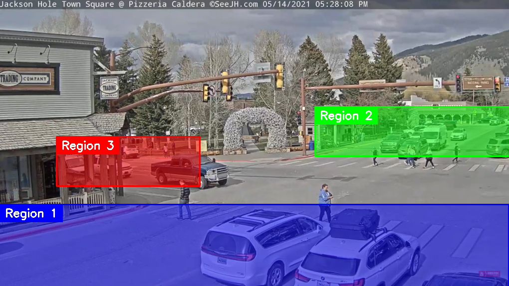

<div align='center'>
	<h1> Análisis de tráfico con redes neuronales - LEICI - UNLP</h1>
</div>

<div align='center'>
	<h4>
		Análisis de tráfico utilizando redes neuronales para la detección y seguimiento de vehículos y peatones
	</h4>

[](https://colab.research.google.com/drive/1wT50-X1Bj7p1Ncxf5yga0QcdYJo2KSjl?usp=sharing)

</div>

<br>

En este repositorio se presenta el trabajo realizado durante el proyecto de investigación y desarrollo "Análisis de tráfico utilizando redes neuronales para la detección y seguimiento de vehículos y peatones" en el **Instituto de Investigaciones en Electrónica, Control y Procesamiento de Señales -** [**LEICI**](https://leici.ing.unlp.edu.ar/) de la [**Facultad de Ingeniería**](https://www.ing.unlp.edu.ar/) de la [**Universidad Nacional de La Plata**](https://unlp.edu.ar/). El sistema consiste de un algoritmo de detección, seguimiento y conteo de vehículos y peatones utilizando cámaras de video para un posterior control de las luces de un semáforo.

## Resultados video de USA
<p align="center"></p>


## Resultados video de Japón
<p align="center"></p>

<br>


## Ejecución 🚀 <A NAME="comenzando"></A>

[](https://colab.research.google.com/drive/1wT50-X1Bj7p1Ncxf5yga0QcdYJo2KSjl?usp=sharing)

Para realizar unas primeras pruebas sobre el código desarrollado, se recomienda realizar la ejecución sobre el **Notebook** desarrollado en la plataforma **Google Colab**. Siguiendo las instrucciones que se detallan en dicho notebook, podrá realizar una ejecución completa del sistema.

### Instalación y dependencias

Los pasos a seguir para correr el sistema son sencillos y se explican a detalle en dicho Notebook. En primer lugar, es necesario clonar el repositorio y descargar las dependencias necesarias, para eso se ejecutan los siguientes comandos:

```
git clone https://github.com/flemingmartin/analisis_trafico
```

```
pip install pafy
pip install youtube-dl
```
### Generador Regiones

Luego, es necesario definir las regiones de interés en nuestro caso particular. Por defecto se tienen guardadas las regiones de los vehículos correspondientes al video de USA, dichas regiones se muestran a continuación:

<p align="center"></p>

Para personalizar las regiones, se requiere contar con una imagen de la intersección, y ejecutar el script **generador.py** que se encuentra en la carpeta **generar_regiones** de la manera:

```
cd generar_regiones
```
```
python generador.py
```

Esto dará como resultado un **output.txt**, el cual deberá ser reemplazado por el archivo **regiones.txt** de la carpeta **tracking**

### Modelo

Una vez instaladas las dependencias, y generadas las regiones, se deberá descargar el modelo que se desee utilizar. El mismo puede ser un modelo **YOLOv4** o **YOLOv4 Tiny** y deberá ser transformado a Tensorflow utilizando el script **save_model.py**

#### YOLOv4
```
cd tracking
```
```
wget https://github.com/AlexeyAB/darknet/releases/download/darknet_yolo_v3_optimal/yolov4.weights -P data/
```
```
python save_model.py
```

#### YOLOv4-Tiny
```
cd tracking
```
```
wget https://github.com/AlexeyAB/darknet/releases/download/darknet_yolo_v4_pre/yolov4-tiny.weights -P data/
```
```
python save_model.py --tiny --weights ./data/yolov4-tiny.weights --output ./checkpoints/yolov4-tiny-640
```

### Tracking

Una vez realizados los pasos anteriores, se puede utilizar el script **object_tracker.py** para realizar la detección y seguimiento de objetos. Para esto se ejecuta el siguiente comando con los parámetros dependiendo de las configuraciones que se hayan realizado previamente.

```
python object_tracker.py --size 640 --weights ./checkpoints/yolov4-640/ --dont_show --info --output ./data/video/output.mp4
```


## Autores ✒️ <A NAME="autores"></A>

* **Fleming, Martín** - Alumno - [GitHub](https://github.com/flemingmartin/)
* **Rosendo, Juan Luis** - Docente


## Contacto 🎁 <A NAME="contacto"></A>

Si tiene alguna pregunta o sugerencia, no dude en contactar a cualquier miembro del equipo.